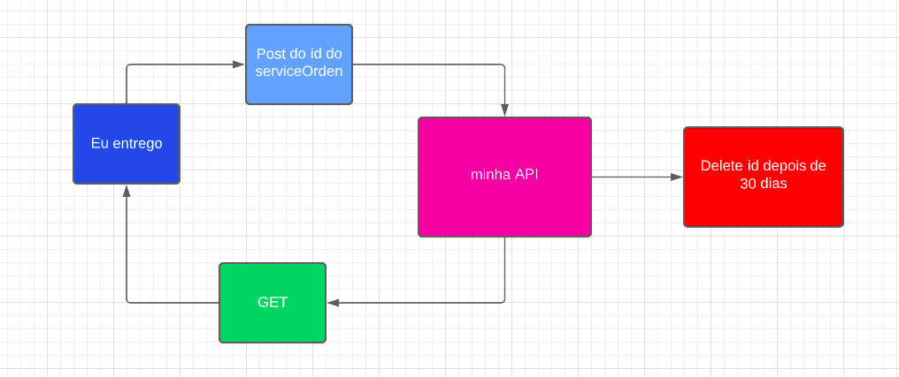
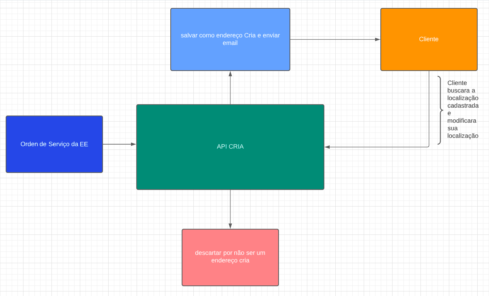
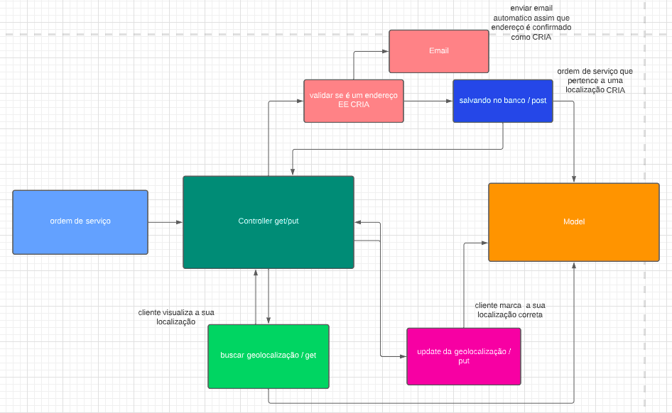

<br />
<p align="center">

  <h3 align="center">CRIA API</h3>
 <br />
  <p align="center">
     Sumário
      <p align="center">
  <a href="#sobre"> Sobre </a> |
  <a href:"#fluxo"> Fluxo </a> 
  <a href="#rotas-da-aplicação"> Rotas da aplicação </a> |
  <a href="#conhecimentos-praticados"> Conhecimentos praticados </a> |
  <a href="#tecnologias-utilizadas"> Tecnologias utilizadas </a>      
       <br />
    <br />
  </p>
</p>


# Sobre
CRIA é uma api que processa ordens de serviço da empresa de logistica EE, tem como funcionalidade monitorar ordens de serviço para casas de dificil acesso. 

Esta Api foi cria por uma equipe de estagiarios da calindra com intuito de apresentar um produto que possa fazer a diferença.

# Fluxo
</p></br>
</p></br>
</p></br>

# Rotas da aplicação:

## Franquias

<b>[GET]</b> /cria- A rota deve exibir todos os clientes.<br>

<b>[GET]</b> /cria/id - A rota deve listar um cliente baseado em seu ID.<br>

<b>[POST] </b> /cria/address - A rota recebera uma ordem de serviço e validara se ela pertence a uma localidade cadastrada como cria <br>

<b>[PUT]</b>/cria/newAddress - A rota servira para que o cliente final modifique sua geolocalização.

<b>[POST]</b>/ee/serviceOrder - A rota é porta de entrada para todo o sistema, ela recebe o id da ordem de serviço e desencadeia todo o sistema.


```json
{
"serviceId":"string",
"zipCode":"string",
"latitude": "number",
"longitude":"number",
"email":"email@email.com.br"
}
```

<b>[PUT] </b> /cria/newAddress/id - A rota deve atualizar um cliente com as informações passadas no body da requisição com os dados da latitude e longitude..<br>

```json
{
"latitude": "number",
"longitude":"number",
}
```

<!-- <b>[DELETE] </b> /franquias/id - A rota deve deletar uma franquia baseado em seu ID.<br> -->

 
# Rodando o projeto:

### Pré-requisitos:
Antes de começar, você precisará instalar em sua máquina as seguintes ferramentas:
[Node.js](https://nodejs.org/en/), [Insomnia](https://insomnia.rest/download) ou [Postman](https://www.postman.com/).

### Instalando e rodando o projeto:


# Clone este repositório
$ git clone https://github.com/henriqueferrazo/api_CRIA

# Instale as dependências do projeto
$ yarn install

# Inicie o servidor da aplicação
$ yanr dev

# Utilize o Insomnia ou o Postman para realizar as requisições nas rotas na URL:
http://localhost:3000/


# Conhecimentos Praticados
✔ NodeJs <br>
✔ Express <br>
✔ Mongoose <br>
✔ Mongo Atlas <br>
✔ Typescript <br>
✔ Padrão MVC <br>
# Tecnologias utilizadas: 
<p align="center">
<a href="https://nodejs.org/en/"></a> <a href="https://expressjs.com/pt-br/"></a> <a href="https://insomnia.rest/download"></a> <a href="https://sequelize.org"></a> <a href="https://www.sqlite.org/index.html"></a> 


